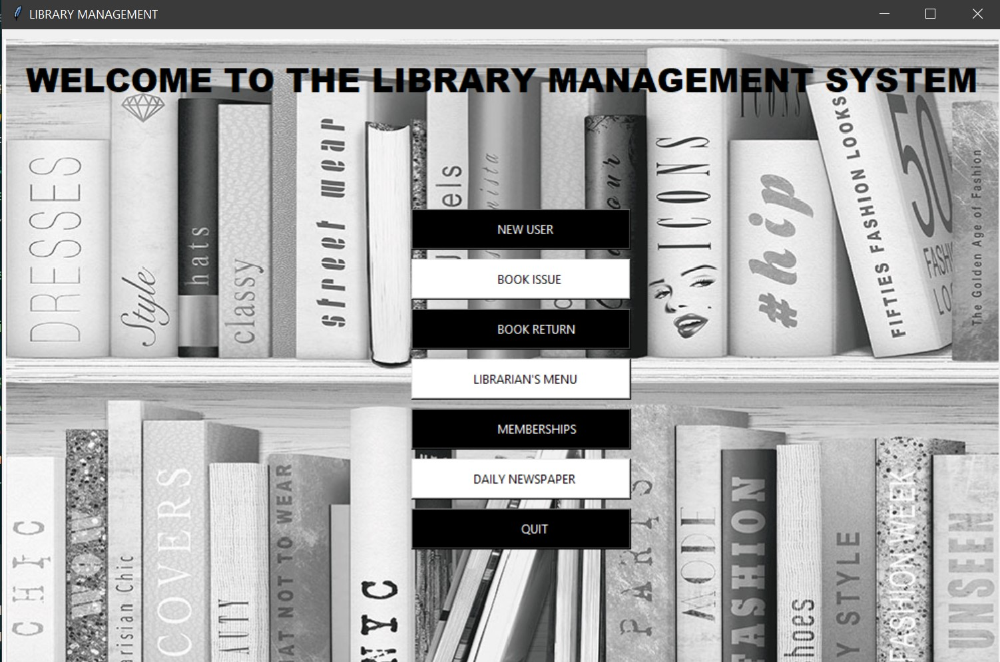

<h1>QuadCode Project Innovision 2021</h1>

> You can read our full Devpost from [here](https://devpost.com/software/library-management-system-8hux1y)

<h2>Inspiration</h2>
<p>With growing technology and time and change being the only constant, even the education sector has become smart. From ebooks, online classes to online or virtual libraries, everything can be found just by a click ! Hence, SMART EDUCATION is the need of the hour ! </p>

<p>Keeping thousands of records of different books and different users can be cumbersome and time consuming. Manual library databases can be slow and erroneous. There is not only waste of resources for physical library cards, record registers, etc but also our most valuable asset, our time. Providing the facility for a free library management system will be the best option to avoid major errors and help us faster the process. </p>

<p>So, we have come up with an idea which solves this problem by not only keeping records of the books issued and returned, but also has provisions for adding new books, removing older books and reading daily newspapers ! </p>

<h2>What it does</h2>
<p>It helps us keep databases of different users and books. New users can register themselves by giving their Full Name, Date of Birth [DOB], Aadhar Number, Contact Number, Username, Password and Gender. They need to keep a note of their username and password for future reference. </p>

<p>Registered users can issue books by giving their Full Name, Name of the Book, Author's Name, Date of Birth [DOB], Date of Issue, Card Number, Username and Password. He can also return the book in the same way.</p>

<p>There is a provision for a librarian who manages the database and can add or remove books.</p>

<p>There is also a feature for glancing through the leading daily 'The Telegraph' and the famous Bengali daily 'Anandabazar Patrika'.</p>

<h2>How we built it</h2>
<p>We have written the base code in Python3 and have also employed tkinter module. We have also used basic concepts of Web scrapping for the newspaper.</p>

<h2>Challenges we ran into</h2>
<p>Adding the newspaper feature was a big challenge for us !</p>

<h2>Accomplishments that we're proud of</h2>
<p>We are really proud of successfully implementing this basic Library Management System which not only solves the basic problem of manually maintaining a huge database but also enables us to read two most popular newspapers.</p>

<h2>What we learnt</h2>
<p>We learnt the concepts of tkinter, web scrapping and advanced features of Python which were required for this project.</p>

<h2>What's next for Library Management System</h2>
<p>We are hoping to extend this feature to every library or book bank and eliminate the need of maintaining manual database. We will soon add more books and advanced features for our user to keep them updated about new books available in the market.</p>

## Install the Dependencies

To use this, first you need to make sure, Python 3 is installed in your system.
To install Python 3 in your system you may checkout Python's official downloads [page](https://www.python.org/downloads/).

## How to Run

First thing you need to do is to clone the repository or download the source code. Run the following command in your terminal to clone the repository:
```bash
git clone https://github.com/IamBikramPurkait/Quadcode-Project-Innovision-2021
```
Next you have to install all the dependent modules which I have listed in ```requirements.txt``` file.
To install the required modules simply run the following inside your terminal: 
```bash
pip install -r requirements.txt
```
Finally to run  this,  all you have to do is to run the ```main.py``` file as shown:
```python
python main.py
```
and thats it.

<h2>Contributor</h2>

[Bikram Purkait](https://github.com/IamBikramPurkait)</br>
[Sutanu Chakraborty](https://github.com/Sutanu19)</br>
[Ishani Samanta](https://github.com/ishanisamanta)</br>
[Ruddranil Patra](https://github.com/Ruddranil)</br>   

## Screenshot
